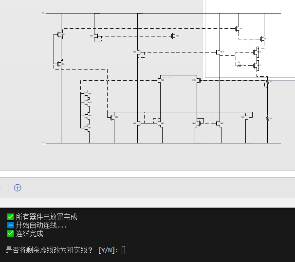
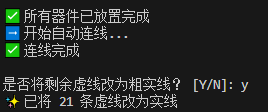

---

# 🧩 CDL Netlist 可视化工具

**Cadence Virtuoso → Visio 图形化展示**

---

## 📦 环境准备

在运行脚本前，请确保以下环境和文件已就绪：

### 软件依赖

- 安装 [Microsoft Visio]
- 安装 Python 及依赖库：
  ```bash
  pip install pywin32
  ```

### 输入文件

1. **`netlist.txt`**  
   - 在 Virtuoso 中导出 CDL 格式网表：  
     `File -> Export -> CDL`

2. **`inst_info.txt`**  
   - 使用以下 Skill 脚本导出实例坐标与方向信息：

     ```lisp
     procedure( exportInstXYOrient(cv outFile)
       let( (fp)
         fp = outfile(outFile "w")
         foreach(inst cv~>instances
           fprintf(fp "Name: %s  Cell: %s\n" inst~>name inst~>cellName)
           fprintf(fp "  XY: %L\n" inst~>xy)
           fprintf(fp "  Orient: %s\n" inst~>orient)
           fprintf(fp "  BBox: %L\n\n" inst~>bBox)
         )
         close(fp)
       )
     )
     exportInstXYOrient( geGetEditCellView() "/home/.../inst_info.txt" )
     ```
3. **`circuit.vss`**  
   - 模拟电路visio模板   

---

## 🚀 使用方法

1. 准备好 `netlist.txt` 和 `inst_info.txt`。
  
2. 运行主脚本：
   ```bash
   python candence_to_visio_V2.py
   ```
   
3. 脚本将自动解析网表与坐标信息，并在 Visio 中生成图形化布局。

---


## 📌 test
- 运行
  


- 手动调整后，交互可将虚线变实线
  


## 📌 tips

- 本工具仅用于辅助绘图，当前仅支持 MOS、R、C 绘制，其他器件以 `Unknown` 代替。
- 连线根据网表生成，非全自动布线。
- 欢迎有兴趣的开发者继续优化与完善！
